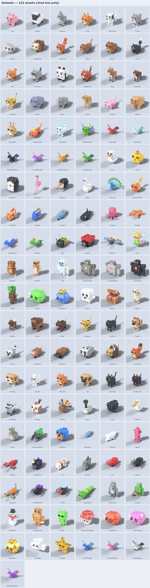

# Stud Low Poly Asset Library (Blender → Roblox)

**1,286 stud low-poly assets** for simulator games, modelled in **Blender** to match
`AnimalBundle_1.rbxl` and its screenshots: blocky chamfered shapes, square pixel eyes, flat
shading, a shared colour palette and the same square-tile **stud overlay** your animals use.
Every model is a real Blender mesh, ready for the Roblox 3D Importer.

**Just want the files?** Grab the ZIPs in [`downloads/`](downloads): one per category, a
Quick Start ZIP with the 10 all-in-one category FBX files, and the Blender source. Every ZIP
includes a `HOW_TO_IMPORT.txt`.

| Category | Count | What's inside |
|---|---:|---|
| [Food](previews/Food.png) | 99 | 32 fruits, 18 vegetables, 32 snacks & meals, drinks, treats (cakes, candy, holiday eggs) |
| [Tools](previews/Tools.png) | 122 | Pickaxe, Heavy Pickaxe, Drill, Axe, Shovel, Hammer, Hoe, Scythe, Fishing Rod, Bug Net, Coin Magnet, Chainsaw × 8 tiers, 4 Legendary pickaxes (Flame, Frost, Crystal, Void), 22 everyday / farm / simulator tools |
| [Weapons](previews/Weapons.png) | 159 | Sword, Greatsword, Scimitar, Katana, Dagger, Rapier, Mace, Flail, Halberd, BattleAxe, Spear, Trident, WarHammer, Bow, Crossbow, Staff, Wand, Shield × 8 tiers, 6 Legendary swords (Flame, Frost, Thunder, Shadow, Nature, Crystal), 9 specials |
| [Furniture](previews/Furniture.png) | 132 | seating (sofas, armchairs, beanbags, dining chairs in 8–10 colours), tables, bedroom, kitchen & appliances, bathroom, living room, electronics, music, lighting, decor, pets, storage |
| [Nature](previews/Nature.png) | 119 | 32 trees (fruit, gem, candy, rainbow, willow, jungle, bonsai…), bushes, flowers, plants, 7 crop plots, rocks, 9 ores, 8 crystal clusters, terrain (floating island, cliff, volcano, waterfall, pond…), sky (clouds, rainbow, sun, moon, tornado) |
| [Props](previews/Props.png) | 172 | 22 pet eggs, 8 tiered chests / loot crates / keys / backpacks, currency & gold bars, pickups, potions, pads & portal, obby parts (checkpoint, finish line, spikes, lava, trampoline, speed & jump pads), awards, town & farm props, spooky & holiday props, magic items |
| [Animals](previews/Animals.png) | 121 | **rigged & animated**: 81 pets, farm and wild animals, birds, sea creatures and bugs, plus 40 **mythical** creatures (10 dragons, 3 golems, Treant, Yeti, Werewolf, Cyclops, Hellhound, Robot Dog, Mimic, Sea Serpent, Basilisk, Frost Wolf, Jackalope, Salamander, Fairy, Phoenix Chick, Alien, Snowman, Gingerbread, 5 slimes, Ghost, Cloud & Star pets…) |
| [Vehicles](previews/Vehicles.png) | 85 | cars in 10 colours, sports cars, jeeps, pickups, vans, limo, race car, convertible, service vehicles, buses, construction (excavator, bulldozer, dump truck, cement mixer, forklift, tow & garbage trucks), motorcycles, go-karts, scooters, bicycle, skateboard, hoverboard, ATV, snowmobile, boats, jet ski, submarine, helicopter, airplane, blimp, hot-air balloon, rocket, spaceship, UFO, train |
| [Buildings](previews/Buildings.png) | 84 | houses in 8 colours, two-storey houses, apartments, skyscraper, 9 shops (bakery, candy, pet, burger, arcade…), cinema, museum, civic buildings, stalls & stands, street furniture (vending machines, ATM, phone booth, dumpster…), landmarks (castle keep, pagoda, pyramid, greek temple, lighthouse…), fun park (ferris wheel, carousel, slide, swings, stage), farm and military buildings |
| [Military](previews/Military.png) | 61 | artillery (cannons, howitzer, mortar, anti-tank, gatling, naval cannon), turrets & launchers, siege weapons, 8 tanks, APC, armored car, jeeps & trucks, missile truck, patrol boat, battleship, attack helicopter, fighter jet, bomber, cargo plane, drones, 7 guns, ammo & supply drops, field gear, battlefield props |
| [Commercial](previews/Commercial.png) | 90 | **21 walk-in buildings with full interiors**: Diner, Burger Restaurant (with drive-thru), Pizzeria, Sushi Bar, Coffee Shop, Ice Cream Parlor, Donut Shop, Grand Bank (vault, tellers, gold), Supermarket, Convenience Store, Clothing, Electronics, Jewelry and Pet stores, Pharmacy, Hair Salon, Laundromat, Gym (boxing ring), Arcade, Office, Movie Theater; plus 69 interior fixtures (booths, stoves, fryers, grills, counters, registers, shelves, checkouts, racks, teller counters, vault door, treadmills, claw machines, cinema seats...) |
| [Tycoon](previews/Tycoon.png) | 42 | tycoon plots (dropper tycoon and restaurant tycoon starter layouts), 8 tiered droppers, conveyors, upgraders, furnace, cash collector, buy buttons, owner door; steal-style bases with numbered pedestal slots, laser door, lock button and red-carpet conveyor; simulator builds (sell shop, egg hatchery, upgrade shop, rebirth shrine, leaderboard, zone gates, daily reward, quest board, shop stand) |

The animals complement the ones already in AnimalBundle (Cat, Cow, Horse, Lion, Tiger, Wolf,
Shark, Whale, T-Rex, Unicorn, Pegasus, Griffin, Hydra, Kraken and many more), with no duplicates.



## The style: "stud low poly"

Measured from `AnimalBundle_1.rbxl` and reproduced here:

* **Blocky low poly.** Like the bundle's lion, bear and elephant: chamfered boxes, square pixel eyes
  (black square with a white highlight), boxy muzzles and ears, square-section tails and limbs, and
  flat shading. Curved things use few sides (8 or fewer). Most assets are under 4,000 triangles; the biggest
  (tall apartment blocks) stay under 15,000, well inside Roblox's 20,000-per-mesh limit.
* **Studs.** Each animal in the bundle carries 6 `Texture` objects (one per face,
  `rbxassetid://9527811247`, 9 studs per tile, Transparency 0.4). `roblox/StudStyle.lua` adds
  exactly that in one click. The previews use this library's own classic round-stud texture, rendered
  in Blender (`textures/Stud.png`, StudsPerTile = 2, i.e. studs every half stud). Because the studs are a separate overlay,
  you can leave them off for games that don't want the stud look.
* **One palette for everything.** All meshes are UV-mapped to one 512×512 atlas
  (`textures/StudPalette.png`, 298 named colours; see `textures/PaletteReference.png`).
  One texture upload colours the whole library. Matching metalness and roughness atlases make
  metals and gems shine when used as a `SurfaceAppearance`.
* **Tiers match your animals.** Wood → Stone → Iron → **Gold → Diamond → Emerald → Ruby → Rainbow**.
  The gem tiers use the same tints as the Gold, Diamond, Emerald, Ruby and Rainbow animal sets.
* **Real stud scale.** 1 Blender unit = 1 stud. A chair seat is ~1.8 studs high, a table ~3, a door
  ~7, pets 2–5 studs long, trees ~12–16 studs tall.

## Folder layout

```
downloads/                                  ready-made ZIPs to download (see top of this page)
exports/fbx/<Category>/<Asset>.fbx          one FBX per asset (palette texture embedded)
exports/packs/<Category>.fbx                whole category in one FBX -> imports as a Model of MeshParts
exports/animations/<Animal>/<Animal>_<Clip>.fbx   Idle / Walk (+ Fly or Swim) per animal
blend/<Category>.blend                      editable Blender files, every asset laid out on a grid
textures/                                   StudPalette (+ Metalness/Roughness), Stud.png overlay
previews/                                   contact sheets + a render of every asset
catalog.json                                every asset: size in studs, triangle count, files
roblox/StudStyle.lua                        optional one-click stud overlay for Studio
roblox/BuildingSetup.lua                    optional one-click glass / collision setup for buildings
blender/                                    the Blender build scripts that made everything
```

## Importing into Roblox Studio

1. **File → Import 3D** (3D Importer) → pick an FBX from `exports/fbx/...`, or a whole
   category from `exports/packs/...`.
2. In the importer, keep the scale unit at **Studs**. Check the size against `catalog.json`
   (for example, `Apple` is about 1.3 × 1.3 × 1.6 studs). If it looks 100× off, change the file's
   scale unit in the import settings.
3. The embedded palette texture comes in automatically. For extra shine on metals and gems, upload
   the three `textures/StudPalette*.png` files and put them in a `SurfaceAppearance`
   (ColorMap / MetalnessMap / RoughnessMap). `StudStyle.lua` can do this for you.
4. **Studs:** select the imported models, paste `roblox/StudStyle.lua` into the Command Bar and
   press Enter. It adds the same 6-face stud overlay as AnimalBundle.
5. If a model faces backwards, set the importer's **World Forward** option (Blender models face −Y).

**Vehicles, machines & military** come in as a Model whose moving pieces are separate MeshParts
(`<Name>_WheelFL`, `_Rotor`, `_Propeller`, `_Turret`, `_Barrel`, `_Blades`, `_Dish`...) with their
origin at their own centre, ready for HingeConstraints or any vehicle chassis.

**Buildings with interiors (Commercial).** Doors are 8 studs tall and ceilings 13, so normal avatars
walk right in. Each building is a Model of separate MeshParts: `<Name>` (floor, walls, facade),
`<Name>_Roof` (hide it for a cutaway / top-down view), `<Name>_Glass`, `<Name>_DoorL` / `_DoorR`,
and furniture groups such as `_Kitchen`, `_Counter`, `_Dining`, `_Aisles`, `_Vault` that you can move
or delete. Select the building and run `roblox/BuildingSetup.lua` in the Command Bar: it makes the
glass see-through and sets `CollisionFidelity = PreciseConvexDecomposition` so doorways are walkable.
Each building has an inside preview too (`previews/Commercial/<Name>_Inside.png`).

**Tycoon and simulator builds.** Scriptable bits are separate parts: `_Belt`, `_Ore`, `_Laser(s)`,
`_Button`, `_Barrier`, and `_Slot1`…`_Slot14` on the steal-style bases.

**Tools and weapons** stand upright with their pivot on the grip, where the hand holds them.
Put the MeshPart in a `Tool` as `Handle` and adjust `Tool.Grip`, for example with a grip editor plugin.

**Rigged animals.** Import `exports/fbx/Animals/<Animal>.fbx`: the 3D Importer creates a skinned
MeshPart with Bones and an AnimationController. To add motion, open the **Animation Editor**
on the rig → **⋯ → Import → From FBX Animation** → pick
`exports/animations/<Animal>/<Animal>_Walk.fbx` (or `_Idle`, `_Fly`, `_Swim`), then publish.
Bones are named `Root`, `Body`, `Head`, `LegFL`, `LegFR`, `LegBL`, `LegBR`, `Tail`, `WingL`,
`WingR`, `FinL`, `FinR`, `ArmL`, `ArmR`, `Tentacle1..8`. Each body part follows one bone
rigidly, which is the cleanest deformation for low poly.

## Editing in Blender

Open `blend/<Category>.blend` (Blender 4.2+). Each asset is its own object, grouped in
collections by sub-category (Fruit, Pickaxe, Seating...). Animals are armatures, and their
actions (`<Animal>_Idle`, `_Walk`, ...) are in the Action editor.

* **Recolour:** in the UV editor, move a face's UVs onto another palette cell, or edit
  `StudPalette.png`.
* **Re-export for Roblox:** File → Export → FBX with *Apply Scalings: FBX Units Scale*,
  *Forward: −Z*, *Up: Y*, *Apply Transform* on (off for armatures), *Path Mode: Copy* and embed
  textures.

## Making more assets (optional)

Everything was produced by Blender itself, driven by the scripts in `blender/`. To rebuild or add
assets, you need Blender, or `pip install bpy pillow numpy` (Python 3.11):

```bash
python3 blender/build.py                        # rebuild everything (~70 min on 4 cores)
python3 blender/build.py --style round          # softer, rounded low-poly variant of everything
python3 blender/package.py                      # re-make the download ZIPs
python3 blender/build.py --only Food,Props      # just some categories
python3 blender/build.py --names Apple --out /tmp/test   # quick test render
blender -b -P blender/build.py -- --only Tools  # same thing with a normal Blender install
```

A new asset is a few lines in `blender/assets/<category>.py`:

```python
@asset("Plum", CAT, sub="Fruit")
def plum(m):
    m.sphere(r=0.5, seg=14, rings=10, color="grape", loc=(0, 0, 0.5))
    stem_leaf(m, (0, 0, 0.98))
```

Tiered variants come for free: register the builder once for every tier in `studlib/tiers.py`.
